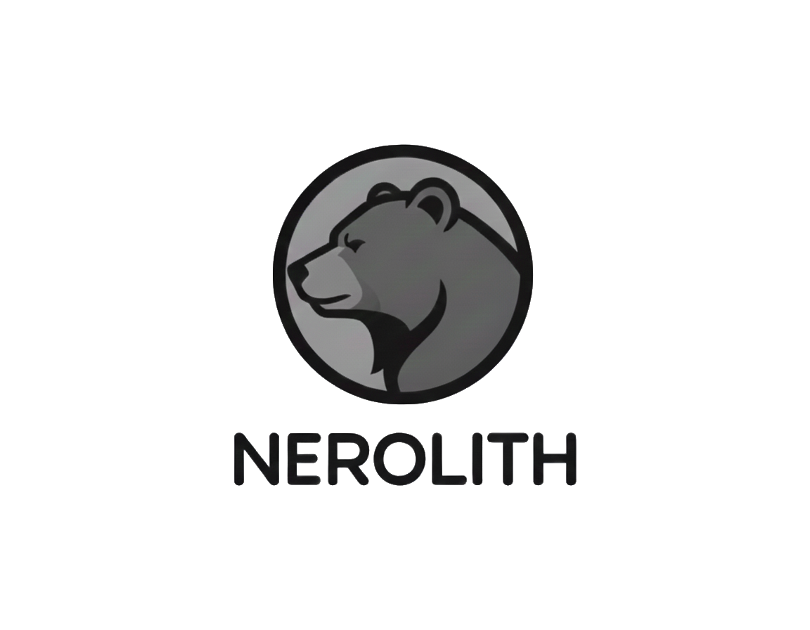

# nerovision


repository to collect my computer vision algorithms and make them reusable


## Deep Learning Features

### Autoencoding
the functionality to train autoencoder is given in the subrepo of:
````python
from nerovision.dl import auto_encoding
````
there is a jupyter notebook describing the process to use the autoencoder for images.
Look underneath "examples/autoencoder.ipynb"
